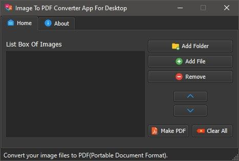

  <h1><strong>Image-To-PDF Convert (Desktop Application For Windows)</strong></h1>
  

  <!-- Version -->

   
 
  <!-- Build -->
  
  <!-- License -->
  
  <!-- Warning -->
  

  
This is an "Image-To-PDF Convert" (open source) software build for Windows. You can convert your image files to
PDF(Portable Document Format) files using this software. Just select your image files or the folder containing the images and convert them all into PDF file
quickly.

   
  
Built With: Python 3.7, PyQT5, PILLOW / PIL (Python Image Library).

 

  This Image to PDF Converter Software Tool is built by
    <a href="https://github.com/keeslucas">Kees Lucas</a>
  

## Screenshots

  
  

## Features

- Add Folder Containing Images
- Add Single Image Files To List
- Remove Image Files From List
- Dark Theme
- Change The Order of Images to Make A PDF
- Create A PDF at Your Desired Location 
